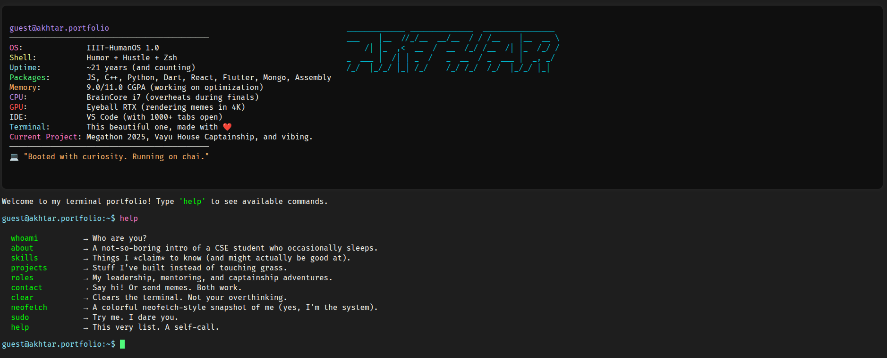

# My-Portfolio: Terminal based

Welcome to my portfolio, but make it terminal. Inspired by the Linux CLI, this interactive terminal interface showcases who I am, what I’ve built, and why you should probably not run `sudo rm -rf`.

## Tech Stack

- **HTML5**
- **CSS3**
- **JavaScript**

## Features

- `help`    → Shows all available commands
- `whoami` → Identity, existential edition
- `about` → My not-so-boring intro
- `skills` → Tech stack and hidden powers
- `projects` → Code I wrote instead of sleeping
- `roles` → Leadership + achievements
- `contact` → Drop a hi or hire me maybe
- `neofetch` → Linux-style "me" snapshot (with cool ASCII)
- `sudo` → Try it. It’s fun.
- `clear` → Clears the screen (not your thoughts)

## Inspiration

Inspired by the hacker-type portfolios and CLI tools like:
- `neofetch`
- `bash`
- Terminal-style games and dashboards

## Preview

